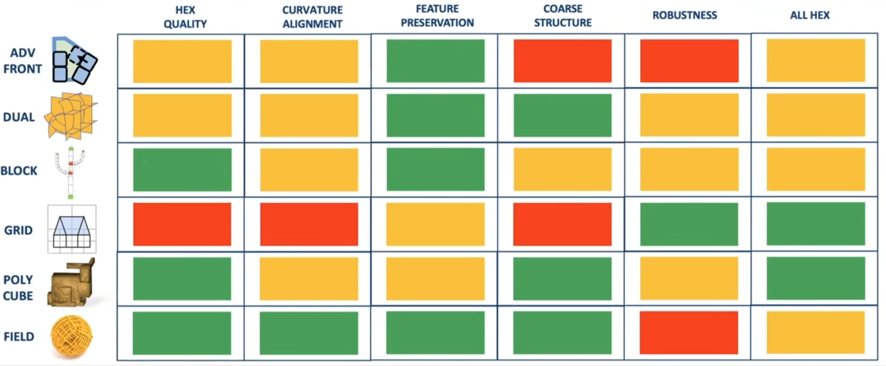
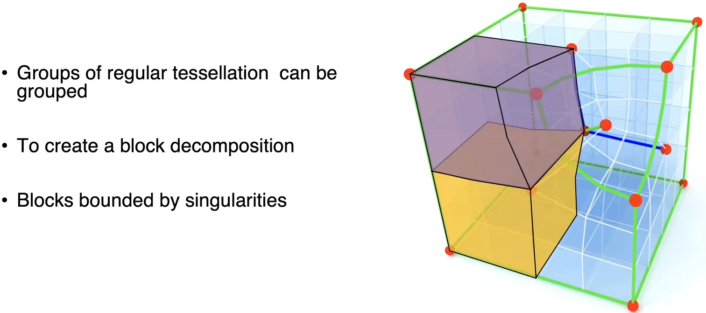
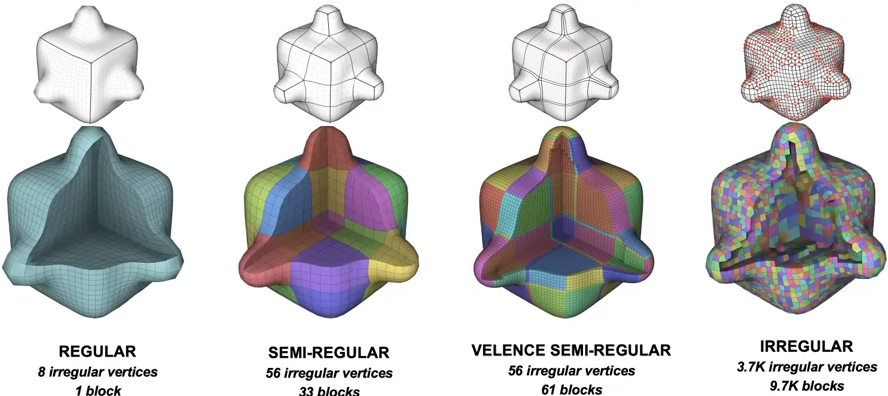
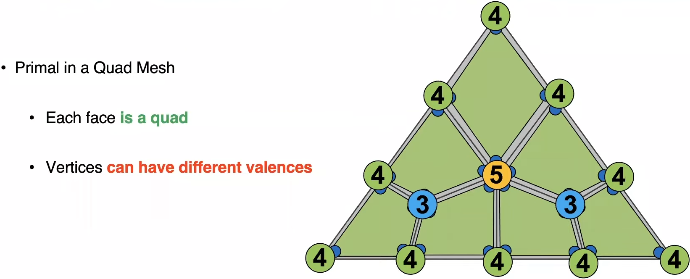
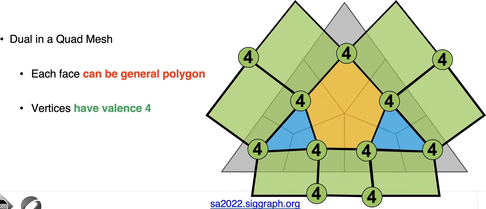

# A Course on Hex-Mesh Generation and Processing: SIGGRAPH Asia 2022

# 奇异图（singularity graph）

有了奇异图，可以将mesh分解为多个块（block/chunk），块中的元素可以是regular tesselated element

# hex mesh的分类

- regular
- semi-regular : 大多数情况我希望得到这种，因为它能够根据几何体的特征，构造奇异线
- valence semi-regular: 
- irregular: 

# 对偶（dual structure）

